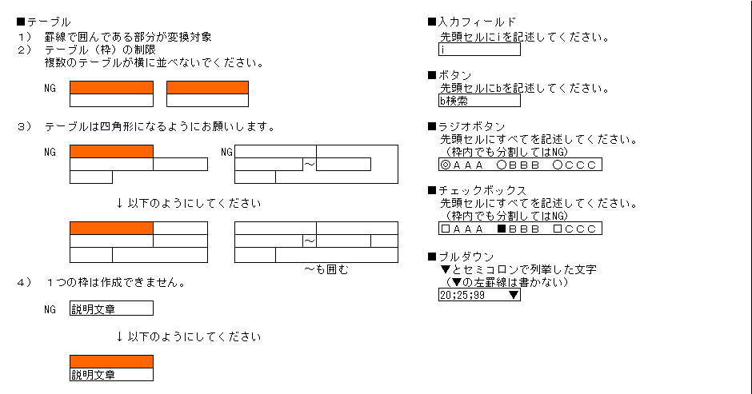

エクセルの罫線やセルを使って描いたイメージ元に、HTMLに変換するツールです。

[デモ(GAE)](https://cosmic-palace-124107.appspot.com/)

[エクセルサンプル](./excel_sample)

## 使い方
### エクセルを編集する
- エクセル編集のルールを参考にしてください。
- 変換対象になるシート名は、inputです。
- 有効な範囲は、B4からBD41までです。

### エクセルファイルをアップロードする
1. エクセルファイルを編集する
1. ファイルを囲み線の中にドラッグアンドドロップする  
あるいは  
ファイル選択ボタンを押してファイルを選択する  
1. エクセル送信を押す

## エクセル編集のルール
